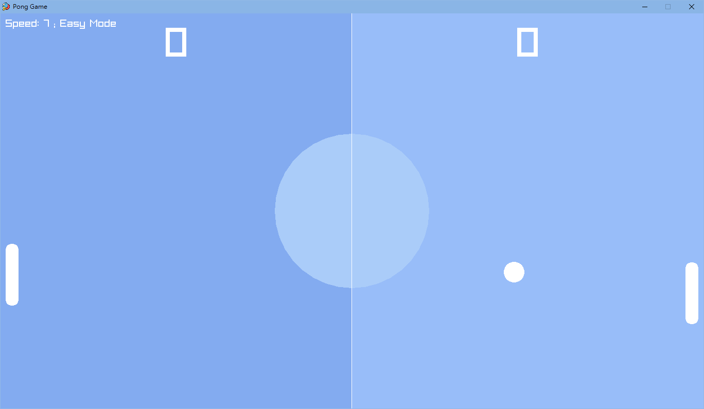
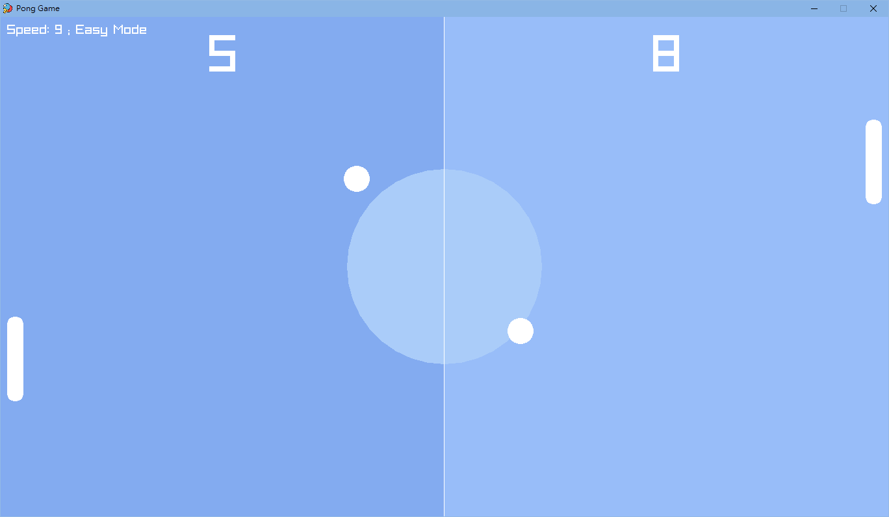
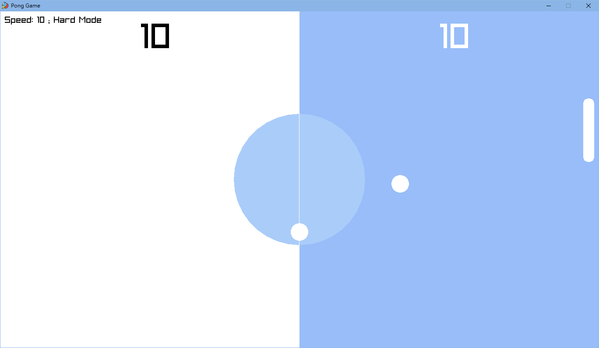
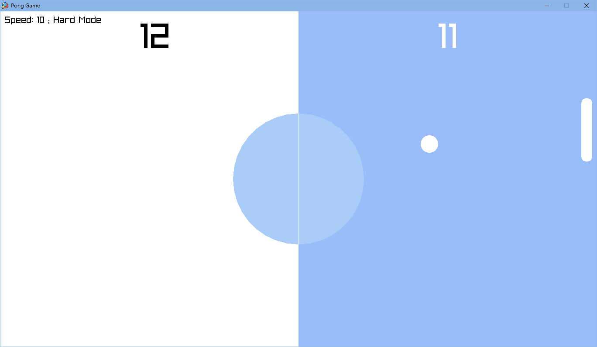

# Pong Game 🏓

The project was made in July 2023.

This Pong Game is a modern take on the classic table tennis game where players compete against the AI. Points are earned each time the ball hits the opposing boundary. Unlike traditional versions, as scores increase in this game, both the speed and difficulty level rise correspondingly.

## Pong Game Demos 🖥

### Game Interface

### Two-ball Mode

### Hard Mode 1

### Hard Mode 2

## Requirement 🔧

- **raylib library**: Ensure you have raylib installed and set up in your development environment.

## Features 🚀

- **Dynamic Gameplay**: As players or the AI accumulate points, the game increases its difficulty by adjusting paddle sizes, ball speeds, and more.

- **AI Opponent**: Compete against a computer-controlled paddle that adjusts its movements based on the ball's position.

- **Scoring System**: Keep track of scores for both the player and the AI.

- **Two-ball Mode**: When either player or the AI scores 5 or more points, a second ball enters the gameplay, adding an extra layer of challenge.

- **Difficulty Modes**: The game starts in "Easy Mode" but switches to "Hard Mode" once either player reaches 10 points.

## How to Run 🏃

1. Ensure you have the raylib library installed and set up.

2. Compile and run the code using C++ compiler.

3. Use the `UP` and `DOWN` arrow keys to control your paddle.

4. Press `ENTER` or `ESC` to exit the game at any time.

## Executable Included 🖥️

I understand that not everyone may have the necessary C++ compilers or the `raylib` library installed. To ensure that as many people as possible can experience the game without the need for compilation, this project includes an `.exe` file that can be run directly.

## Credit 🙌

This project utilizes the starter template provided by [educ8s](https://github.com/educ8s/Raylib-CPP-Starter-Template-for-VSCODE-V2). Special thanks to him for providing the foundational setup and tutorial for raylib, making the development process smoother.

## Icon Credit 🌟

[Ping pong icons created by Freepik - Flaticon](https://www.flaticon.com/free-icons/ping-pong)

## License 📄

- The template used is protected under its original MIT License. For details, please refer to the [LICENSE-TEMPLATE](./LICENSE-TEMPLATE.txt) file.